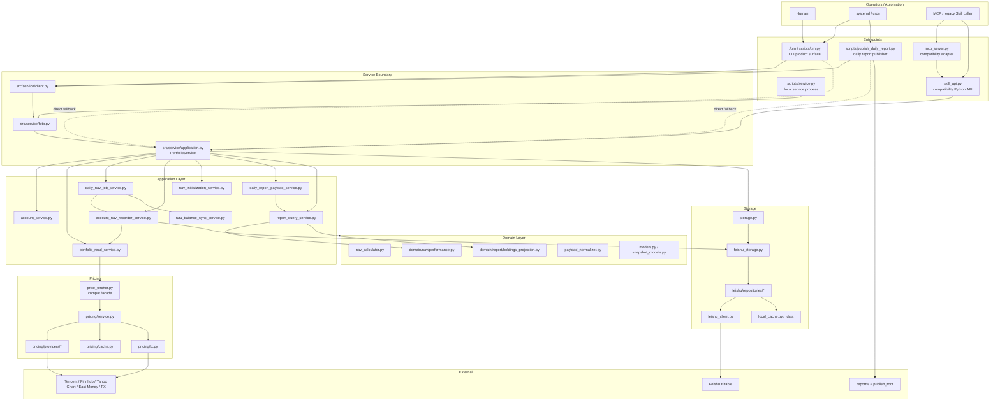

# Architecture

The project is now a CLI + local-service portfolio product. The service and app
layers own product behavior; `skill_api.py` and MCP remain compatibility
adapters for older callers.

## Current Shape

## Ownership Rules

- New product behavior enters through `src/service/application.py`.
- Multi-step workflows live in `src/app/*`.
- Pure calculations live in `src/domain/*`.
- Quote-source code lives in `src/pricing/*`.
- Feishu table-specific read/write code lives in `src/feishu/repositories/*`.
- `skill_api.py` must stay a thin compatibility adapter.
- `PortfolioManager` and `PriceFetcher` are compatibility facades, not places
  for new orchestration.

## Core Daily NAV Workflow

`DailyNavJobService` is the canonical scheduled workflow.

1. Resolve NAV date. If omitted, use the most recent business day before the
   run date.
2. Skip NAV dates that are weekends or configured `calendar.holidays`.
3. Resolve target accounts from CLI input or current holdings.
4. Audit duplicate `nav_history` account/date rows and block writes if found.
5. Reconcile-check manual `cash_flow` rows and block writes if generated fields
   are pending.
6. Optionally sync Futu cash/MMF holdings before valuation.
7. Build one priced valuation snapshot per account.
8. Record NAV and then persist `holdings_snapshot`.
9. Return per-account status and summary.

## Report Boundaries

- `AccountNavRecorderService` owns side effects for one account: optional Futu
  sync, snapshot build, NAV write, and holdings snapshot persistence.
- `DailyReportPayloadService` consumes the already-built snapshot and NAV fact.
  It does not fetch prices or write NAV.
- `ReportQueryService` owns read-only full-report queries. Synthetic NAV preview
  exists only here through `NavPreviewService`.
- `scripts/publish_daily_report.py` is the only daily HTML publisher.

The old public daily-report domain is invalid. Publishing creates local static
artifacts only and returns `public_url=null` with
`public_url_status=disabled`.

## Storage Boundaries

Feishu Bitable is the production source of truth. Core tables:

- `holdings`
- `cash_flow`
- `nav_history`
- `holdings_snapshot`

Optional capability tables:

- `transactions`
- `compensation_tasks`
- `schema_version`

Table-level logic belongs in repositories under `src/feishu/repositories/*`.
The mixins under `src/feishu/*` are thin `FeishuStorage` method facades.

## Current Risks

- Feishu is the only production backend; there is no full offline write mode.
- Schema changes are still managed by docs and checks, not automatic migration.
- Some historical Python API tests still instantiate `PortfolioSkill`; keep that
  path covered but do not grow it.
- Cross-table writes are not database-transactional; compensation and audit
  surfaces remain important.

## Next Architecture Priorities

1. Keep shrinking compatibility behavior in `skill_api.py`.
2. Add stronger schema version checks for Feishu tables.
3. Improve structured run logs for scheduled daily NAV jobs.
4. Add a local read-only backup/export path for recent holdings, NAV, and report
   bundles.
