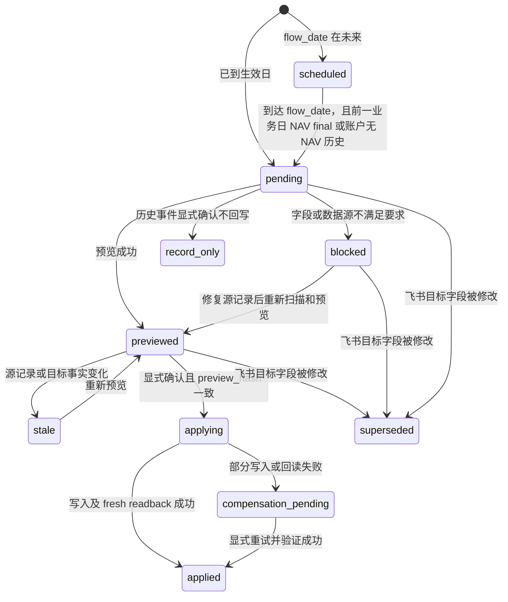

# Cash Flow 驱动现金持仓变更设计

状态：已确认部分作为后续实现与验收基线；仍需产品确认的入口和日期语义集中
列在第 22 节，确认前不得在实现中自行选择。

本文定义手工录入 `cash_flow` 后，如何在用户逐条确认的前提下更新
`holdings` 中同账户、同券商、同币种的 `CASH` 项目。本文描述目标设计，
不是对当前代码已实现能力的声明。

## 1. 目标

用户继续在飞书多维表手工维护外部入金、出金事实。系统发现新增或修改的
`cash_flow` 后：

1. 明确解析唯一目标：`account + broker + currency + CASH`。
2. 生成可审阅的绝对现金持仓目标。
3. 每条事件单独预览、单独确认。
4. 确认前重新读取所有事实；目标发生变化时原确认失效。
5. 以幂等、可补偿、可审计的方式写入 `holdings`。
6. 在 unresolved effect 存在时阻断正式 NAV 写入。

该功能不把 SQLite 变成投资事实账本，也不让定时任务绕过人工确认。

## 2. 已锁定的产品边界

### 2.1 纳入范围

- 只处理外部入金和外部出金。
- `broker` 必填且必须显式选择。
- 只影响同账户、同券商、同币种的 `CASH` holding。
- `cash_flow` 仍以飞书多维表为事实来源，主要入口是手工录入。
- 支持历史补录。
- 写入 holding 前逐条确认。
- 任一目标相关字段发生变化，都必须重新预览、重新确认。
- 第一阶段只支持 `CNY`、`USD`、`HKD`。

### 2.2 不纳入范围

- 券商之间或账户之间的内部转账。
- 现金与货币基金之间的内部划转。
- 换汇交易。
- 用一个币种的 cash flow 改写另一个币种的 CASH。
- 在浏览器或后台定时任务中静默确认。
- 依赖当前汇率推导历史现金余额。

内部转账和换汇未来应使用独立事件模型，不能伪装成两个外部 cash flow。

`cash_flow` 表在第一阶段被定义为“只记录外部资金变化”的业务表，不增加
`movement_scope` 字段。scanner 只接受 `DEPOSIT/WITHDRAW`；内部转账和换汇
必须使用未来的独立事件模型，不得写入本表。系统仅凭方向无法证明用户真实
意图，因此文档和回执不得声称已自动识别外部/内部语义。

## 3. 数据权威

| 数据 | 权威来源 | SQLite 是否复制为事实 |
|---|---|---|
| 外部入金/出金 | 飞书 `cash_flow` | 否，只保存确认时的快照和指纹 |
| 当前现金持仓 | 飞书 `holdings`；Futu 目标由 OpenD 观测 | 否 |
| Futu 分币种现金 | OpenD `accinfo_query` 的 `cn_cash/us_cash/hk_cash` | 否，只保存一次观测证据 |
| effect 状态、确认、补偿、审计 | 本机 SQLite | 是，这是技术工作流权威 |
| NAV | 现有 PM NAV 写入链路 | 否 |

SQLite 文件默认位于：

```text
${PM_DATA_DIR}/cash_flow_effects.sqlite3
```

可通过 `PM_CASH_FLOW_EFFECTS_DB_PATH` 指定其他持久化路径。SQLite 不新增到
飞书，也不取代 `cash_flow` 或 `holdings`。

## 4. 飞书字段

### 4.1 `cash_flow`

在现有 `cash_flow` 表增加：

- `broker`：文本或单选，必填，值必须与 `holdings.broker` 的规范值一致。

目标相关字段为：

- `flow_date`
- `account`
- `broker`
- `amount`
- `currency`
- `flow_type`

输入校验：

- `amount` 必须有限、非零，并按现金精度量化为小数点后两位。
- `currency` 第一阶段只接受 `CNY`、`USD`、`HKD`，禁止自动猜测或降级。
- `broker` 去除首尾空白后仍不能为空；第一阶段不做别名模糊匹配。
- `broker=富途` 才进入 Futu OpenD 权威路径，其他文本都按非 Futu 处理。
- `flow_date` 使用北京时间业务日期；未来日期的处理仍需按第 22 节确认。

`amount` 使用带符号金额：

- 入金：正数，`flow_type=DEPOSIT`
- 出金：负数，`flow_type=WITHDRAW`

符号和 `flow_type` 不一致时阻断，不自动猜测用户意图。`dedup_key` 增加
`broker` 维度，避免相同账户在不同券商的同日同额事件互相去重。

`cny_amount` 和 `exchange_rate` 仍服务于 NAV/报告的人民币计价，不参与
同币种 CASH 目标计算。

为使历史汇率证据可审计，在 `cash_flow` 增加系统生成字段：

- `exchange_rate_date`：汇率适用日期；非 CNY 必须等于 `flow_date`。
- `exchange_rate_source`：provider/资料来源的稳定标识，不能只写“manual”。
- `exchange_rate_evidence_type`：`provider`、`manual_supplement` 或
  `cny_identity`。

人工补证只在历史 provider 无法取得 `flow_date` 汇率时允许。用户必须显式提供
rate、rate date 和可追溯 source，再通过独立
`pm cash-flow reconcile --apply --confirm` 写回。缺任一字段、date 不匹配
flow_date、source 含糊或确认记录不存在时，generated-field gate 继续阻断。
补证入口按单条记录执行：

```bash
pm cash-flow reconcile \
  --record-id RECORD_ID \
  --exchange-rate RATE \
  --rate-date YYYY-MM-DD \
  --rate-source SOURCE \
  --apply --confirm
```

普通 provider reconcile 不接受“当前汇率”作为历史记录的隐式输入。

### 4.2 `holdings`

不增加 effect 状态字段。现金目标使用既有业务键：

```text
(asset_id, account, broker)
```

币种映射：

| currency | asset_id |
|---|---|
| CNY | `CNY-CASH` |
| USD | `USD-CASH` |
| HKD | `HKD-CASH` |

其他币种若未来开放，使用 `<CURRENCY>-CASH`，但必须先补充定价和验收用例。

## 5. SQLite 模型

### 5.1 `effect_meta`

- `schema_version`
- `cutover_date`

`cutover_date` 首次初始化后不可修改。配置与 SQLite 中已绑定的日期不一致、
配置被删除、数据库丢失或数据库损坏时，正式 NAV 和 effect 写入均阻断。

### 5.2 `cash_flow_effects`

每个飞书记录可以有多个版本。核心字段：

- `effect_id`
- `effect_kind`：`cash_flow`、`broker_cash_reconciliation` 或
  `cash_holding_external_change`
- `hash_contract_version`
- `record_id`
- `version`
- `source_hash`
- `source_json`
- `state`
- `mode`
- `account`
- `broker`
- `currency`
- `signed_amount`
- `flow_date`
- `target_source`
- `before_json`
- `targets_json`
- `preview_hash`
- `warnings_json`
- `confirmation_json`
- `compensation_task_id`
- `last_error`
- `created_at`
- `updated_at`

金额在 SQLite 和 hash payload 中保存为规范 Decimal 字符串，不使用二进制
float。`source_hash` 和 `preview_hash` 使用带版本的 canonical JSON +
SHA-256；升级 hash contract 时必须显式创建新版本或执行迁移，不能让普通软件
升级悄悄使全部确认失效。

### 5.3 `cash_flow_effect_events`

append-only 审计事件，记录发现、预览、失效、确认、开始写入、写入结果、
补偿创建和最终核销。业务判断使用 `cash_flow_effects` 当前状态，调查过程使用
events。

### 5.4 `cash_flow_scan_runs`

记录每次全量或账户级扫描的边界和结果：

- `scan_run_id`
- `scope`
- `started_at` / `completed_at`
- `status`
- `source_record_count`
- `source_digest`
- 新增、修改、删除、blocked 数量
- `error`

只有完整分页读取成功并写入 `completed` 的扫描，才可以据“源记录缺失”创建
deletion version。读取中断、分页不完整或 SQLite 提交失败时，不允许推断删除。

### 5.5 `cash_holding_fingerprints`

按 `(asset_id, account, broker)` 保存受监控 CASH holding 的最近确认状态：

- `holding_identity`
- `holding_record_id`
- `last_confirmed_amount`
- `last_confirmed_hash`
- `last_observed_amount`
- `last_observed_hash`
- `confirmed_by_effect_id`
- `observed_at` / `updated_at`

fingerprint 使用规范 Decimal 和版本化 canonical JSON。初次 activation 必须在
显式 init/audit 中确认现有 CASH baseline；之后只有成功 applied 的 effect、
明确的 `record_only` baseline 接受操作或受控 recovery 能更新
`last_confirmed_*`。普通 scan 只能更新 observation，不能暗中接受新 baseline。

### 5.6 `cash_flow_fx_confirmations`

generated fields 的 append-only 确认证据：

- `confirmation_id`
- `record_id`
- `source_hash`
- `exchange_rate`
- `exchange_rate_date`
- `exchange_rate_source`
- `exchange_rate_evidence_type`
- `cny_amount`
- `confirmation_json`
- `confirmed_at`

`confirmation_json` 与第 13 节相同，只保存未认证的本机 CLI 上下文。飞书中
generated fields 后续被修改时，旧 `source_hash` 的确认不得继续使用；
重新 reconcile 和确认后才可通过 gate。

### 5.7 `cash_flow_effect_receipts`

作为回执 outbox 和去重记录：

- `receipt_key`，唯一
- `receipt_type`
- `effect_id` 或 `scan_run_id`
- `payload_json`
- `status`
- `attempt_count`
- `message_id`
- `last_error`
- `created_at` / `updated_at`

没有持久化 outbox 时，不能声称 scanner 会在发送失败后可靠重试，也不能可靠
抑制相同 scan digest 的重复回执。

### 5.8 初始化、文件权限和单机边界

运行时不得因配置了 cutover 就静默创建一个空数据库。首次启用使用显式命令：

```bash
pm cash-flow effects init --cutover-date YYYY-MM-DD --confirm
```

初始化负责创建 schema、绑定 immutable cutover、完成首次全量扫描，并输出
需要逐条处理的历史记录。普通 scan、review、confirm 和 NAV 入口在数据库
缺失时一律阻断。

第一阶段只支持一个运行主机、一个持久化 `PM_DATA_DIR` 和同一个 systemd
运行用户。SQLite 文件及其 WAL 必须对其他本机用户不可写。多主机共享 SQLite、
在开发机和生产机分别维护 effect 状态、或把数据库放在不支持可靠文件锁的
网络文件系统上，均不受支持。

## 6. 状态机



正式 NAV 只放行每条当前版本均为：

- `applied`
- 明确确认的 `record_only`

`pending`、`blocked`、`previewed`、`stale`、`applying`、
`compensation_pending` 全部阻断。

`scheduled` 不允许 preview/confirm；当目标 `nav_date < flow_date` 时不阻断
该 NAV。到达 flow_date 后，如果前一业务日 NAV 尚未 final，保持 scheduled，
允许前一业务日 NAV 完成，但阻断 flow_date 当日及之后的 NAV。账户从未存在
任何 NAV 时不要求虚构前一日 NAV，到达 flow_date 直接转为 `pending`；effect
完成前仍阻断该账户的首个正式 NAV。

## 7. 扫描和版本

扫描必须读取当前飞书 `cash_flow` 和受监控 CASH holdings 全集或指定账户全集，
不能依赖仅追加游标。原因是飞书端无法禁止直接修改和删除。

扫描过程持有 scanner 全局锁。同一时刻只允许一个 scan run；所有分页读取完成
后，才能在一个 SQLite 事务中创建 version、标记 superseded、推断 deletion
并提交 scan run。账户级扫描只能判断该账户内、SQLite 已知记录的删除，不能
改变其他账户的 effect。

`source_hash` 至少覆盖所有目标相关字段。处理规则：

- 新记录：创建 version 1。
- 目标相关字段未变化：保留当前版本，不重复创建 effect。
- 目标相关字段变化：创建新版本，旧的未完成版本变为 `superseded`。
- 已 applied 事件被修改：新版本必须表达旧影响的撤销和新影响的应用，
  重新逐条确认。
- 记录被删除：创建 deletion 版本。已 applied 的非 Futu 事件需要预览撤销；
  Futu 使用新的 OpenD 绝对现金观测，不用数学方式猜测撤销结果。
- 只修改 `remark` 等不影响目标的字段：记录事实快照变化用于审计，但不使
  已确认的目标失效。
- 同一个 `record_id + source_hash` 被 15 分钟 scanner、manual review 和
  NAV preflight 重复观察时，只能对应同一个 effect version。

scanner 同时比较 CASH holding 当前指纹与 `last_confirmed_hash`：

- 变化能与持锁执行中的 effect target 对应时，等待该 effect 的 fresh
  readback 核销，不创建竞争事件；confirm/apply 与 scanner 共用 scanner/account
  锁，避免把授权写入误判为外部修改。
- 变化不能由已确认 effect 解释时，创建或更新
  `cash_holding_external_change`，并阻断正式 NAV。
- Futu 以对应 profile 的 OpenD 分币种现金作为恢复 target；scanner 本身不连接
  OpenD，target 在 review/preview 时获取，仍需逐条确认后才能写 holding。
- 非 Futu 必须逐条选择：明确 `record_only` 接受当前值为新 baseline，或以
  `apply` 恢复 `last_confirmed_amount`；两种选择都进入 preview hash 并要求
  `--confirm`。
- 直接修改后的当前值恰好等于 last confirmed target 时，记录审计 observation
  后可核销为无 drift，不产生多余写入。

任何扫描失败都不能被解释为“没有待处理事件”。

## 8. 历史补录和 cutover

配置：

```yaml
cash_flow:
  effects:
    cutover_date: YYYY-MM-DD
```

或：

```text
PM_CASH_FLOW_EFFECTS_CUTOVER_DATE=YYYY-MM-DD
```

规则：

- `flow_date < cutover_date`：默认 mode 为 `record_only`，仍需逐条显式确认，
  不改写当前 holding。
- `flow_date >= cutover_date`：mode 为 `apply`。未来日期先进入 `scheduled`；
  到达北京时间 flow_date 后，有 NAV 历史的账户需等前一业务日 NAV final
  才转为 `pending`；从未有 NAV 的账户直接转为 `pending`。随后都必须预览
  并确认 holding 目标。
- 历史事件确实需要影响当前 holding 时，使用明确的 historical apply
  override；override 本身进入确认指纹。
- 不存在自动批量确认。

部署时允许先发布代码再配置 cutover，但一旦 SQLite 已绑定 cutover，就不能
通过删除配置、改日期、删库或切回旧路径绕过门禁。

首次 activation 必须经过 `effects init`。数据库丢失或损坏后只能从受控备份
恢复，或使用明确的 recovery 流程重新全量分类；普通运行入口不能自动重建后
继续 NAV。

## 9. 非 Futu 券商算法

非 Futu 没有可信的实时现金 API，第一阶段使用估算：

```text
target = fresh_current_holding + signed_cash_flow_amount
```

要求：

- holding 必须通过 Feishu 强制新鲜读取，不能使用内存或磁盘缓存。
- 目标标记 `target_source=estimated_current_plus_event`。
- 非 Futu 出金计算后若 target < 0，阻断。
- 不做币种转换。
- 不跨 broker 寻找“同名现金”。
- holding 不存在时，current 按 0 处理；创建目标仍需确认。

已 applied 事件的修改使用净变化：

```text
same identity: target = fresh_current - old_signed_amount + new_signed_amount
```

若 account、broker 或 currency 改变，则生成两个绝对目标：旧身份撤销、
新身份应用。两个目标属于同一个 effect 和同一次确认。

对已有 holding 只更新 `quantity` 和 `updated_at`，不覆盖名称、标签和人工
分类。创建新 CASH 行时使用规范的 asset_id、currency、`asset_type=cash`
和 `asset_class=现金`。同一业务键存在多条 holding 时阻断，不能任取第一条。

## 10. Futu 现金算法

### 10.1 精确接口

Futu 接入层使用一次强制刷新的账户资金查询：

```python
trade_ctx.accinfo_query(
    trd_env=...,
    acc_id=...,
    refresh_cache=True,
)
```

只读取以下原始分币种字段：

| currency | OpenD 字段 |
|---|---|
| CNY | `cn_cash` |
| USD | `us_cash` |
| HKD | `hk_cash` |

禁止使用：

- 已废弃的聚合 `cash`
- `available_funds`
- `withdraw_cash`
- `power`
- 将 `currency` 展示参数下的聚合结果重新标记为某个币种
- PM 自行按当前汇率拆分或合成分币种现金

必须能区分字段值为 `0` 和字段缺失。目标币种字段缺失、OpenD 调用失败、
返回非有限数或证据不完整时直接阻断，不回退到 holding 计算。

Futu preview/confirm 和 stock sync 共用统一 account profile 配置：

```yaml
futu:
  profiles:
    lx:
      host: 127.0.0.1
      port: 11111
      acc_id: ...
      trd_env: REAL
    sy:
      host: 127.0.0.1
      port: 11112
      acc_id: ...
      trd_env: REAL
```

路由规则：

- 使用 `effect.account` 精确选择同名 profile。
- confirm 不提供临时 profile 选择或 host/port/acc_id override。
- profile 缺失、重复、字段不完整或查询证据不能证明使用了预期 `acc_id`
  时阻断。
- `account + host + port + acc_id + trd_env` 的非敏感指纹进入 observation
  evidence 和 `preview_hash`；profile 改变会使旧 preview 失效。
- `currency`/`cash_currency` 不参与分币种现金含义，目标仍只来自
  `cn_cash/us_cash/hk_cash`。
- activation 后不再回退到主配置加 `futu-sy.env` 的隐式路由。

### 10.2 目标与告警

Futu 的绝对目标为 OpenD 当前观测值：

```text
target = observed_<currency>_cash
expected_from_event = fresh_current_holding + signed_cash_flow_amount
variance = target - expected_from_event
```

`target` 和 `expected_from_event` 不要求相等。variance 非零时展示告警并记录
审计证据，用户仍可确认 OpenD 的绝对目标。

OpenD 返回的真实负现金允许写入和参与估值。非 Futu 的估算出金仍禁止产生
负目标。

### 10.3 Futu 定时同步改造

现有 `pm futu sync` 和定时任务不再直接写任何 CASH holding：

- STOCK/ETF 数量和 `average_cost` 保持现有同步。
- MMF 保持现有独立行为，本方案不改变其业务定义。
- CASH 改为 observe-only，只输出分币种观测与 drift。
- CASH 写入只能由已确认的 cash-flow effect 或已确认的 reconciliation
  effect 执行。

drift 不会自动伪造一条外部 `cash_flow`。系统只在 SQLite 中创建
`broker_cash_reconciliation` 技术事件，仍需单独预览和确认。

reconciliation effect 不新增、修改或删除飞书 `cash_flow`，因此不影响外部
资金流累计。它只表达“OpenD 绝对现金与 holding 不一致”的技术修正：

- identity 为 `account + 富途 + currency + CASH`。
- 同一 identity 的未完成 reconciliation 只保留一个当前版本。
- 新观测目标改变时旧 preview 变为 `stale`，生成新版本并重新确认。
- drift 为零时不创建 effect；已存在未完成 effect 时记录 resolved-by-observation，
  不执行多余 holding 写入。
- 未解决的 reconciliation 与未解决 cash-flow effect 一样阻断正式 NAV。

同一 Futu cash identity 同时存在 cash-flow effect 和 drift 时，cash-flow
effect 优先：

- 有未完成 cash-flow effect 时不另建 reconciliation；其 preview 会重新读取
  OpenD，并把当次精确分币种结果作为预览证据。
- 已存在 reconciliation 后发现新的 cash-flow fact 时，下一次 observation
  将 reconciliation 标记为 `superseded_by_cash_flow`，由 cash-flow effect
  承接同一个绝对目标。
- reconciliation 已进入 `compensation_pending` 时不得被 supersede；先完成
  原绝对目标和 fresh readback，再根据最新事实创建新的待确认版本。
- 历史 `record_only` 不占用该优先级。

## 11. 预览和确认契约

### 11.1 Preview

preview 返回：

- effect/source identity
- current holding 的 fresh 快照
- 绝对 target 或多 target
- target source
- Futu observation evidence
- expected delta 和 variance
- warnings/blockers
- `preview_hash`

`scheduled` effect 不生成 preview。修改 flow_date 会创建新 effect version，
已存在的 preview/confirmation 全部失效。

`preview_hash` 覆盖：

- effect/version/source hash
- mode 和 historical override
- 所有目标 identity
- fresh before state
- 所有绝对 target
- Futu 分币种观测值和账户配置指纹

不把纯时间戳放入 hash，避免同一事实因观测时间变化而无意义失效。

### 11.2 Confirm

confirm 必须同时提供：

- `effect_id`
- `preview_hash`
- `--confirm`

确认流程：

1. 获取 scanner coordination lock、account 级锁和 effect 锁。
2. 重新读取飞书 cash_flow。
3. 重新强制读取 holding。
4. Futu 再执行一次 refreshed `accinfo_query`。
5. 重新计算 preview。
6. 校验该 effect 仍是 record_id 的最新版本。
7. hash 不一致则标记 `stale`，不写 holding。
8. 先把 SQLite 状态持久化为 `applying`。
9. 以绝对 target 和 compare-and-set 语义写 Feishu holding。
10. 强制 fresh readback holding，并再次读取 cash_flow source。
11. 全部目标和 source 仍一致后标记 `applied`。

若 fresh current 已等于 target，记录 `already_applied`，不得重复加减。

如果修改记录产生多个 account/identity target，必须按稳定排序一次性取得所有
account 锁，避免两个相反方向的修正发生死锁。任一锁或 fresh read 失败时，
在开始写 Feishu 前整体阻断。

飞书不提供跨 cash_flow/holding 的原子事务，也不能禁止用户在 compare 与 write
之间直接编辑。若 post-write source read 发现并发修改，系统保留已经发生的
绝对 target 写入证据，立即创建最新 correction version 并保持 NAV 阻断；
不得把旧 version 冒充为当前事实已 applied。

## 12. 补偿

飞书与 SQLite 之间没有跨系统事务。多目标写入或回读失败时：

- effect 进入 `compensation_pending`。
- 创建 `CASH_TARGET_SET` compensation task。
- payload 保存所有绝对 target、每个 target 的 before 状态和已完成结果。
- 每次真实重试都必须再次传入 `--confirm`。
- retry 使用 compare-and-set；当前状态既不等于 before 也不等于 target 时阻断。
- compensation 成功后必须 fresh readback，并把 effect 核销为 `applied`。
- `compensation_pending` 期间再次修改或删除事实，只记录 deferred source
  change，不得覆盖当前 effect；补偿完成后立即创建新的 correction version，
  并要求重新 preview/confirm。
- effect retry 入口负责调用现有 compensation service 并核销 effect；直接使用
  通用 `compensation retry` 后，下一次 audit 也必须能够根据 resolved task 和
  fresh readback 完成核销，不能永久留在 `compensation_pending`。

不允许退回 delta 重放，也不允许因补偿失败改用旧的 cash 更新路径。

## 13. 操作者证据

当前系统没有可信操作者身份。确认记录只保存未经认证的本机上下文：

- `method=local_cli`
- confirmation time
- run_id
- hostname
- local username

这些字段只能回答“从哪个本机上下文发起”，不能作为可信身份或授权证明。
第一阶段不开放远程 HTTP confirm 接口。

## 14. NAV fail-closed 门禁

门禁必须放在最终 NAV 持久化权威入口，而不只放在 CLI 或 daily job：

1. 扫描/核对目标账户当前 Feishu cash_flow。
2. 检查 cash_flow 系统生成字段 reconciliation 是否完成。
3. 检查删除和目标字段变化。
4. 检查 SQLite cutover、最近成功 scan run 和数据库完整性。
5. 检查 cash-flow effect 与 broker reconciliation effect 的当前状态。
6. 任一不确定、扫描失败或 unresolved effect 存在时拒绝正式 NAV 写入。

daily job 可提前展示同一 blocker，但 `NavRecordService` 的正式写入门禁不可
绕过。NAV dry-run 可以返回估值和 blocker，不得把 preview 当成已解决。

对 scheduled effect，NAV gate 按目标 nav_date 判断：`nav_date < flow_date`
时放行该项；`nav_date >= flow_date` 时必须已转为并完成 `applied`，否则阻断。
有 NAV 历史时，前一业务日由 PM 业务日历计算，不能简单使用自然日前一天；
从未有 NAV 的账户不要求补造前一日 NAV，但 effect 未完成前仍不能写首个 NAV。

holding effect 与 `cny_amount/exchange_rate` 是两条独立校验链：

- effect 只使用原币 `amount` 更新同币种 CASH，不等待或计算人民币目标。
- 现有 cash-flow generated-field reconcile 继续为 NAV/报告提供人民币证据。
- `pm cash-flow review` 可以显示 generated-field blocker，但不得顺带静默
  写回汇率或 CNY 金额；只提示用户另行执行
  `pm cash-flow reconcile --apply --confirm`。
- generated fields reconcile 与 holding effect preview/confirm 是两套独立确认，
  不得合并为一次授权。
- `cny_amount/exchange_rate` 的生成或变化不改变同币种 CASH target，也不使
  已有 holding preview 失效；其完整性仍由独立的 generated-field gate 判断。
- 正式 NAV 必须同时通过 generated-field gate 和 effect gate。

项目负责生成非 CNY cash flow 的人民币计价证据时，必须使用 `flow_date` 对应
的历史 FX 事实并持久化 rate/amount；禁止以执行 reconcile 当天的当前汇率回填
历史事件。历史 provider 不可得时只允许人工补充同一 `flow_date` 的 rate，
并同时保存可追溯 source 和独立确认记录；缺少任一项时保持 blocker，不能用
当前汇率兜底。

## 15. 入口策略

### 15.1 事实录入入口

主要入口是飞书多维表手工录入 `cash_flow`。录入行为只产生资金事实，不直接
触发 holding 写入，也不把飞书编辑动作本身视为确认。

第一阶段不新增 PM cash-flow HTTP 写接口，也不把 SQLite 作为录入入口。

### 15.2 发现入口

使用三层扫描组合：

1. 独立 systemd timer 每 15 分钟全量扫描一次飞书 `cash_flow`。
2. 操作者运行 `pm cash-flow review` 时，在展示记录前立即扫描。
3. 正式 NAV 写入前再次强制扫描和 audit，作为 fail-closed 保底。

全量扫描以 cash_flow 的 `record_id + source_hash` 以及 CASH holding
fingerprint 与 SQLite 当前版本比较，因此能够发现 cash_flow 新增/修改/删除
和 holding 外部变化。扫描只允许创建/更新 effect、fingerprint observation
和审计状态，不允许自动确认或写 holding。

当前不使用飞书 webhook。若未来需要秒级发现，应先补齐事件验签、重放、
幂等和运行服务边界，再单独评审。

15 分钟 scanner 使用独立 oneshot service/timer、`Persistent=true`、与 NAV
任务相同的 systemd 用户、配置文件和 `PM_DATA_DIR`。scanner 不连接 OpenD，
不做 preview，不写 Feishu holding；它只读取 cash_flow 和 CASH holdings、
提交 SQLite scan run/effect/fingerprint observation 并发送变化回执。

### 15.3 人工处理入口

`pm cash-flow review` 是主要人工工作台：

- 先执行一次即时扫描。
- 按账户展示 pending、blocked、stale 和 compensation_pending。
- 默认逐条展示，不提供 confirm-all。
- preview 只生成绝对目标和 `preview_hash`，不写 holding。

真正写入仍使用显式的 effect 命令，并要求 `effect_id + preview_hash +
--confirm`。`record-only` 和 compensation retry 同样逐条显式确认。

### 15.4 唯一写入入口

所有 cash-flow 引起的 CASH holding 写入必须经过
`CashFlowEffectService`。CLI 只是调用入口，不能自行计算或直接写飞书。

- 定时扫描：只发现。
- NAV preflight：只扫描、审计、阻断。
- Futu scheduled sync：CASH observe-only。
- 飞书手工编辑：只修改 cash-flow 事实。
- compensation：只重试已持久化的绝对 target。

第一阶段不开放 HTTP confirm。当前 loopback HTTP 服务没有可信操作者身份，
不能把“来自本机”当成已认证授权。

### 15.5 旧入口收口

以下现有路径不得继续绕过 effect：

- legacy `deposit/withdraw/add_cash/sub_cash` 全部禁用。
- `pm futu sync` 和 daily-job 的兼容 Futu cash sync 不得直接写 CASH。
- 任何 repository 或兼容 API 都不得复制 effect 目标计算。

为避免旧调用方因方法突然消失而产生不明确失败，兼容方法可以保留，但必须
返回/抛出稳定的 `cash_flow_entry_disabled` 错误并提示“请在飞书 cash_flow
手工录入”。调用不得创建 cash_flow、不得创建 effect、不得修改 holding，也
不得自动转调其他写入口。

schema migration 必须在 activation 前完成：飞书 `cash_flow.broker`、
`docs/schema.md`、schema checker 和 operator manual view 同步更新。任一旧记录
缺 broker 时可以被扫描为 `blocked`，但不能通过 projection fallback 把整个
broker 字段当成可选能力。

### 15.6 CLI 第一阶段

计划提供本机 direct-only 命令：

```bash
./pm cash-flow effects init --cutover-date YYYY-MM-DD --confirm
./pm cash-flow review [--account ACCOUNT] [--json]
./pm cash-flow effects scan [--account ACCOUNT] [--json]
./pm cash-flow effects list [--account ACCOUNT] [--json]
./pm cash-flow effects show --effect-id ID [--json]
./pm cash-flow effects preview --effect-id ID [--historical-apply] [--json]
./pm cash-flow effects confirm --effect-id ID --preview-hash HASH --confirm
./pm cash-flow effects record-only --effect-id ID --confirm
./pm cash-flow effects retry --effect-id ID --confirm
./pm cash-flow effects audit --account ACCOUNT [--json]
```

`confirm`、`record-only` 和 `retry` 不允许 service fallback，也不允许缺少显式
确认参数。

## 16. 回执策略

### 16.1 通道和接收人

Cash Flow 回执复用当前 NAV/Futu 回执配置：

- 飞书机器人：`刘看山`
- App：`feishu.receipt.app_id` / `feishu.receipt.app_secret`
- 接收人：同一个 `feishu.receipt.open_id`

第一阶段不增加 Cash Flow 专用机器人、群聊或第二套接收人配置。

回执只是通知副本，不是确认入口。消息成功送达、被阅读或发生点击，都不能
替代 CLI 的 `effect_id + preview_hash + --confirm`。第一阶段不在飞书消息中
提供确认按钮或确认链接。

### 16.2 回执类型

| 类型 | 触发条件 | 发送规则 |
|---|---|---|
| 发现回执 | 15 分钟 scanner 发现新增、修改或删除 | 每轮合并一条；无变化不发送 |
| 处理回执 | effect 进入 `applied`、`record_only`、`stale` 或 `compensation_pending` | 每次真实操作一条 |
| 运行异常/恢复 | scanner 无法读取飞书、SQLite 异常或随后恢复 | 只在状态变化时发送 |
| NAV 阻断 | unresolved effect 阻断正式 NAV | 并入现有 NAV 汇总回执 |

`pm cash-flow review` 的即时扫描直接把结果展示给当前操作者，不额外发送发现
回执。NAV preflight 使用 NAV 自身回执，避免同一 blocker 重复通知。

### 16.3 发现回执内容

发现回执按扫描批次汇总，至少包含：

- scan digest 和北京时间
- 新增、修改、删除、blocked 数量
- 每条变化的 account、flow_date、broker、currency、signed amount、state
- `effect_id`
- 处理命令：`pm cash-flow review`

同一个 scan digest 成功发送后不重复发送。相同 effects 在状态没有变化时，
后续 15 分钟扫描保持静默。

单条回执最多展开 10 条变化，其余只显示分账户计数和“另有 N 条”，避免飞书
消息被截断。完整列表始终以 SQLite/CLI 为准。

### 16.4 处理回执内容

`applied` 回执只能在所有 target fresh readback 成功后生成，至少包含：

- account / broker
- flow_date、currency、signed amount
- holding before → target
- `target_source`
- Futu `expected_from_event`、实际观测和 variance 告警
- effect ID、run ID 和最终状态

非 Futu 必须明确显示
`target_source=estimated_current_plus_event`。`compensation_pending` 必须显示
“可能部分写入”和 compensation task ID，不能使用成功标题。

### 16.5 发送失败语义

- SQLite/CLI 返回值是处理结果权威，飞书回执是 best-effort 通知。
- 回执失败不得把已 `applied` 或 `record_only` 的 effect 回退。
- 发送结果作为 effect audit event 保存：`sent + message_id` 或
  `failed + error`。
- 发现回执失败时，后续 scanner 可以重试未成功的 digest；成功后停止。
- 飞书请求出现 outcome unknown 时允许出现重复消息，因此消息必须带
  effect ID 或 scan digest 供人工识别。
- 即使回执持续失败，NAV fail-closed 门禁仍然有效。

## 17. 分阶段实现

### Phase 1：闭环

- 飞书 `cash_flow.broker`
- 禁用 legacy `deposit/withdraw/add_cash/sub_cash`
- SQLite schema、immutable cutover、扫描/versioning
- 非 Futu estimated preview
- Futu 分币种 OpenD observation
- 统一 `futu.profiles`，供 Futu stock sync 与 Cash Flow 共用
- 逐条 preview/confirm/record-only
- 绝对 target 写入、fresh readback、compensation
- NAV fail-closed 门禁
- Futu scheduled sync 停止直接写 CASH
- Futu observation drift 创建可确认的 `broker_cash_reconciliation`
- 每 15 分钟执行一次只读飞书扫描的 systemd timer
- `pm cash-flow review` 人工工作台
- 复用刘看山和当前 open_id 的 Cash Flow 发现/处理/异常回执
- 显式 `effects init`、schema migration、backup/recovery runbook
- CLI 和测试

### Phase 2：可用性

- 飞书变更检测的运行摘要和告警
- reconciliation effect 的批量筛选和更清晰的操作体验
- 更清晰的多目标修改/删除预览
- SQLite 定期备份自动化、恢复演练和诊断可视化

### Phase 3：可信身份

- 引入受认证操作者身份后，再评估远程确认接口
- 保留第一阶段所有 target hash、fresh read 和显式确认约束

## 18. 验收标准

至少覆盖以下场景：

1. 手工新增非 Futu CNY 入金，preview 为 current + amount，确认后只更新同 broker 的 CNY-CASH。
2. 非 Futu 出金会产生负目标时阻断。
3. USD/HKD 事件不触碰 CNY-CASH。
4. broker 缺失或无法匹配时阻断。
5. preview 后修改 account/broker/currency/amount/flow_type，旧 hash 失效。
6. 重复 confirm 不重复加减。
7. Futu 读取 `cn_cash/us_cash/hk_cash`，从不读取 deprecated aggregate cash。
8. Futu 精确目标为负数时允许写入且估值能看到该负现金。
9. Futu variance 只告警，不要求与 event delta 相等。
10. OpenD 失败或目标币种字段缺失时阻断且不回退。
11. `pm futu sync` 不再写 CASH，但股票和 MMF 行为不回归。
12. 部分写入创建 compensation；每次 retry 仍要求确认。
13. cutover 前事件只有明确 record-only 后才放行。
14. unresolved、数据库损坏、source scan 失败均阻断正式 NAV。
15. 飞书记录修改和删除能被全量扫描发现。
16. 没有可信操作者身份时，审计明确标记本机信息未认证。
17. 15 分钟 scanner、手工 review 和 NAV preflight 都能发现同一新增记录，
    但不会重复创建 effect 或自动写 holding。
18. scanner 无变化时不发回执；新 digest 只发送一条汇总发现回执。
19. 回执失败不会回退 effect，NAV 门禁也不会因回执失败而放行。
20. Cash Flow 回执使用与 NAV/Futu 相同的刘看山机器人和 open_id。
21. 读取分页中断时不推断 deletion，也不提交成功 scan run。
22. SQLite 缺失时普通 scan/NAV 不会静默创建新库，必须显式 init/recovery。
23. scanner、review 和 NAV 使用同一主机、同一 `PM_DATA_DIR` 的 effect 状态。
24. Futu PM account 无唯一 account profile 或 profile 指纹变化时旧 preview 失效。
25. Futu drift 创建 reconciliation effect，不修改 cash_flow 累计，也不自动写 CASH。
26. cash-flow generated fields 已完成但 effect 未完成时 NAV 仍阻断；反向亦然。
27. 同一 holding identity 有重复行时 preview 阻断。
28. 多 identity 修正以稳定顺序获取全部 account 锁，并能从部分写入进入补偿。
29. 回执 outbox 能抑制已成功 digest 的重复发送，并记录失败重试。
30. Futu cash-flow effect 存在时不会为同一 identity 再创建竞争的 reconciliation。
31. source 在 holding 写入窗口内被修改时，最新 correction 保持 NAV 阻断。
32. hash contract 升级不会静默使全部历史确认失效。
33. 历史非 CNY cash flow 不使用 reconcile 当天的当前 FX 回填。
34. 调用任一 legacy cash API 都返回稳定拒绝结果，且 cash_flow、effect、
    holding 三者均无变化。
35. 未来事件在 flow_date 前保持 scheduled，不能 preview/confirm，也不阻断
    更早 nav_date。
36. 有 NAV 历史的账户到达 flow_date 时，前一业务日 NAV 未 final 会阻断
    effect 转 pending，但不会阻止补齐该前一业务日 NAV。
37. 飞书 CASH holding 被直接修改时，scanner 创建
    `cash_holding_external_change` 并阻断 NAV；授权 effect 写入不会被误报。
38. 非 Futu 外部 holding 修改只能经逐条确认接受为 baseline 或恢复最后确认值；
    Futu preview 只使用对应 OpenD 分币种现金作为恢复 target。
39. 历史 provider 无 rate 时，完整的人工 rate/date/source 经独立确认后可通过；
    缺字段、日期不符、source 含糊或未确认均阻断。
40. 从未有 NAV 的账户到达 flow_date 时直接转 pending；effect 完成前阻断
    首个正式 NAV，且系统不创建 bootstrap 或虚构前一日 NAV。

## 19. 明确禁止的实现捷径

- 继续使用 Futu deprecated aggregate `cash`。
- OpenD 失败后改用 holding + event 作为 Futu 目标。
- 由 PM 把聚合人民币现金按汇率拆成 USD/HKD。
- 写入 cash_flow 时立即写 holding。
- 只在 CLI 检查确认，不在 application/NAV 权威边界检查。
- 用缓存 holding 进行最终确认。
- 批量“确认所有”。
- 用 SQLite 替代飞书的业务事实。
- 把本机 username 描述为已认证操作者。
- 把飞书消息送达、阅读或点击当成 holding 写入确认。
- 在 SQLite 缺失时由 NAV、scanner 或 review 自动创建新库并继续运行。
- 把一次不完整的 Feishu 分页读取解释为记录被删除。
- 让不同主机或不同 `PM_DATA_DIR` 各自维护一套可写 effect 状态。
- 在 reconciliation 尚未实现时先停掉 Futu CASH 写入并继续记录 NAV。

## 20. 激活、备份、恢复和禁止回退

激活顺序：

1. 发布包含完整 gate、scanner、review、Futu observation 和 reconciliation
   的同一版本；不能分开上线 CASH 停写与 reconciliation。
2. 更新飞书 `cash_flow.broker` schema、manual view 和 schema checker。
3. 配置唯一持久化 `PM_DATA_DIR`、cutover、Futu account profiles 和回执。
4. 停止会写 CASH 的旧 timer/service，确认没有旧进程存活。
5. 使用 SQLite online backup API 创建激活前备份。
6. 执行 `effects init --confirm`，完成首次全量扫描。
7. 逐条处理历史 record-only 和 cutover 后 pending。
8. effect audit 全部通过后再启用 15 分钟 scanner 和正式 NAV。
9. 用一次无变化扫描、一次 synthetic pending blocker 和一次 receipt canary 验收。

禁止回退含义：

- activation 后不支持回到缺少 effect gate 的旧版本。
- 不支持恢复“Futu sync 直接写 CASH”或 legacy delta cash writer。
- 修复使用 forward-only 新版本和 schema migration。
- 生产恢复只能使用受控 SQLite 备份或显式 recovery；不得删除数据库重来。

SQLite 备份必须产生一致快照，不能只复制主 `.sqlite3` 文件而忽略活动 WAL。
恢复后必须运行 integrity check、cutover 校验、全量 scan 和 effect audit，才能
恢复 NAV 写入。

## 21. 实现状态与上线边界

本仓库实现已覆盖本文锁定的代码边界：

- legacy `deposit/withdraw/add_cash/sub_cash` 返回稳定拒绝且不写事实。
- Futu adapter 只读取 `cn_cash/us_cash/hk_cash`，CASH observe-only；MMF 和
  股票/ETF 仍按原职责同步。
- generated-field reconcile 不会使用执行当下 FX 回填历史事件；缺历史证据时
  fail closed，人工 rate 需同日、可追溯 source 和独立确认。
- SQLite effect store、显式 init、15 分钟 scanner、review/preview/confirm、
  receipt outbox、补偿和正式 NAV gate 已接入。
- `futu.profiles` 是账户路由的唯一配置，schema checker 要求
  `cash_flow.broker`。

“代码已实现”不等于“生产已上线”。发布、远端升级、飞书 schema migration、
cutover 激活、timer 启用和生产 canary 仍是各自独立的显式操作边界；未完成
这些步骤前，不得宣称运行环境已采用该流程。

## 22. 逐条确认记录

以下会实质改变入口、字段或运行语义的项目均已逐条确认，结论已锁定：

1. **Legacy cash API—已确认**：彻底禁用
   `deposit/withdraw/add_cash/sub_cash`。兼容方法只返回稳定的
   `cash_flow_entry_disabled` 拒绝结果，不产生任何写入。
2. **外部资金显式性—已确认**：不增加 `movement_scope`。`cash_flow` 表本身
   定义为外部资金账本，只允许 `DEPOSIT/WITHDRAW`；内部转账和换汇不得录入。
3. **Futu 多账户路由—已确认**：使用统一 `futu.profiles` 建立
   `PM account -> OpenD profile` 显式映射。preview/confirm 与 stock sync
   共用配置，按 effect.account 自动路由并校验 acc_id；激活后不再使用
   `futu-sy.env` 隐式切换。
4. **未来日期—已确认**：未来 cash_flow 进入 `scheduled`。到达北京时间
   flow_date 后，有 NAV 历史的账户需等前一业务日 NAV final 才转为 pending；
   从未有 NAV 的账户直接转为 pending。更早 nav_date 不阻断，flow_date 当日
   及之后未处理则阻断。
5. **Generated fields 操作入口—已确认**：`pm cash-flow review` 只展示
   `cny_amount/exchange_rate` blocker，并提示另行执行
   `pm cash-flow reconcile --apply --confirm`。汇率证据确认与 holding
   preview/confirm 是两套独立授权；review 不自动写回 generated fields。
   generated fields 的变化不改变同币种 CASH target，也不使 holding preview
   失效。
6. **飞书直接修改 CASH holding—已确认**：scanner 维护 CASH holding
   fingerprint；未经 effect 的变化创建 `cash_holding_external_change` 并阻断
   NAV。Futu 在 preview 时以对应 OpenD 分币种现金为恢复 target；非 Futu
   必须逐条确认“接受当前为新 baseline”或“恢复上一个已确认 target”。
7. **历史 FX 缺失—已确认**：历史 provider 无法返回 flow_date rate 时，
   允许用户显式补充 exchange_rate，但必须同时保存同一 flow_date、可追溯
   source 和独立确认记录；资料不完整继续阻断，绝不采用当前 FX。
8. **全新账户启动—已确认**：不增加 bootstrap。账户从未有任何 NAV 时，
   事件到达 flow_date 直接转为 pending；完成 holding effect 后才能生成首个
   正式 NAV。
