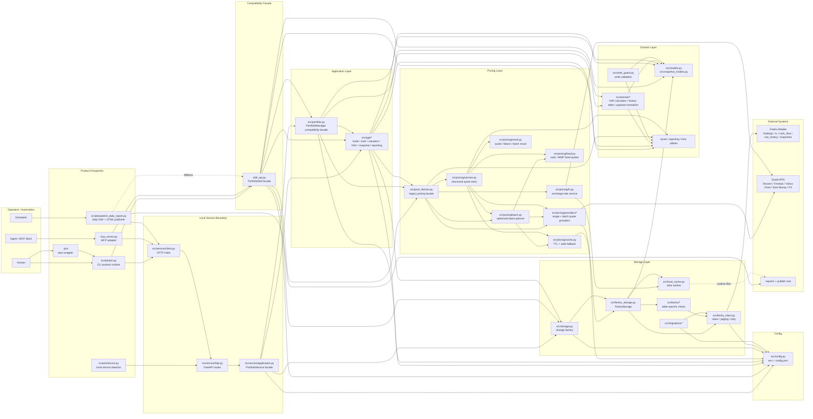

# Dependency Graph

This graph describes the current high-level dependency direction for the CLI
product shape. Edges point from caller or adapter to the component it depends
on.

## Reading Notes

- `./pm` is the human CLI wrapper; `scripts/pm.py` is the actual command
  implementation.
- CLI and MCP paths prefer the local service client and keep `skill_api.py` as
  a fallback/compatibility surface.
- The daily publisher prefers `PortfolioServiceClient.daily_report_bundle()` and
  keeps direct `skill_api.py` only as an unavailable-service fallback.
- `src/service/application.py` owns `list_accounts`, `multi_account_overview`,
  `record_nav`, `get_nav`, `get_holdings`, `get_cash`, `get_distribution`,
  `full_report`, `generate_report`, and `daily_report_bundle` through direct
  `src/app` / `PortfolioManager` paths. `skill_api.py` remains a caller-facing
  compatibility surface and should not own new service behavior.
- Business logic should keep moving downward into `src/app`, `src/domain`,
  `src/pricing`, and storage-specific modules rather than growing the facades.
