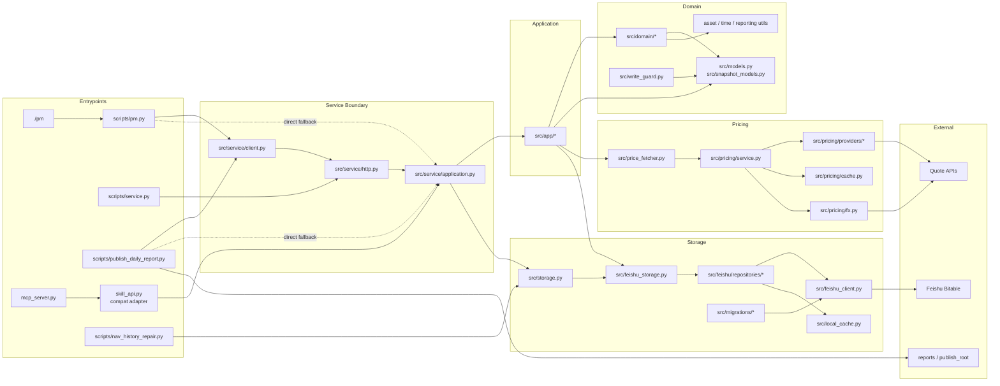

# Dependency Graph

Edges point from caller or adapter to the component it depends on.

## Important Directions

- CLI uses `src/service/client.py` first and falls back directly to
  `PortfolioService`; it no longer falls back through `skill_api.py`.
- `scripts/publish_daily_report.py` also follows service-first behavior and
  falls back to `PortfolioService` for local recovery.
- MCP still goes through `skill_api.py` because that is the compatibility API
  surface.
- `skill_api.py` delegates inward to `PortfolioService` / app services and
  should not own new behavior.
- Feishu table logic belongs in `src/feishu/repositories/*`; mixins are only
  `FeishuStorage` facade methods.
- Read-only full report behavior belongs to `ReportQueryService`.
- Scheduled daily NAV behavior belongs to `DailyNavJobService`.

## Removed Or Legacy Paths

- The old full-report alias layer has been removed.
- `save_nav()`, `upsert_nav_bulk()`, and `update_nav_fields()` are removed.
- Public daily-report URL publishing is disabled; outputs are local artifacts
  with `public_url=null` and `public_url_status=disabled`.
- JSON config is no longer the normal configuration path. Use `config.yaml`;
  legacy JSON is only a direct migration input when explicitly referenced.
